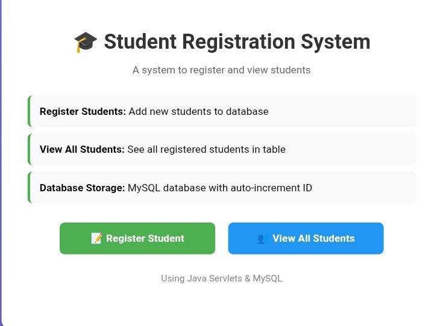

# 📘 Student Registration Web Application

## 📌 Project Overview

The **Student Registration Web Application** is a simple Java web application built using **Java Servlets, JSP, JDBC, MySQL, and Apache Tomcat**.
It allows users to:

* Register students using a web form
* Store student data in a MySQL database
* View all registered students in a tabular format

This project demonstrates **MVC architecture**, **database connectivity**, and **Java EE web development fundamentals**.

---

## 🛠️ Technologies Used

* **Java (JDK 17+ / JDK 25)**
* **Jakarta Servlet API**
* **JSP (JavaServer Pages)**
* **JDBC**
* **MySQL**
* **Apache Tomcat 10.1.x**
* **Maven**
* **Bootstrap 5 (Frontend styling)**

---

## 📂 Project Structure

```
StudentRegistrationApp
│
├── src
│   └── main
│       ├── java
│       │   ├── controller
│       │   │   ├── RegisterStudentServlet.java
│       │   │   └── ShowStudentsServlet.java
│       │   │
│       │   ├── dao
│       │   │   └── StudentDAO.java
│       │   │
│       │   ├── model
│       │   │   └── Student.java
│       │   │
│       │   └── util
│       │       └── DBConnection.java
│       │
│       └── webapp
│           ├── index.jsp
│           ├── students.jsp
│           └── WEB-INF
│               └── web.xml
│
├── pom.xml
└── README.md
```

---

## 🧩 Application Features

### ✅ Student Registration

* User inputs **Name**, **Email**, and **Year**
* Data is validated and stored in MySQL

### ✅ View All Students

* Displays all registered students in a table
* Clean and responsive UI using Bootstrap

---

## 🗄️ Database Setup (MySQL)

### 1️⃣ Create Database

```sql
CREATE DATABASE studentdb;
USE studentdb;
```

### 2️⃣ Create Table

```sql
CREATE TABLE students (
    id INT AUTO_INCREMENT PRIMARY KEY,
    name VARCHAR(100),
    email VARCHAR(100),
    year INT
);
```

### 3️⃣ Update Database Credentials

Edit `DBConnection.java`:

```java
private static final String URL = "jdbc:mysql://localhost:3306/studentdb";
private static final String USER = "root";
private static final String PASSWORD = "your_password";
```

---

## ▶️ How to Run the Project (Step by Step)

### 1️⃣ Install Required Software

* Java JDK
* Apache Maven
* MySQL Server
* Apache Tomcat 10.1.x
* IntelliJ IDEA (Recommended)

---

### 2️⃣ Open Project in IntelliJ IDEA

* **File → Open → Select project folder**
* Wait for **Maven dependencies** to download

---

### 3️⃣ Configure Tomcat Server

* **Run → Edit Configurations**
* Add **Tomcat Server (Local)**
* Deployment:

    * Select **StudentRegistrationApp: war exploded**
* Port: `8080`

---

### 4️⃣ Start MySQL Server

* Start MySQL from:

    * **XAMPP / MySQL Installer / Services**
* Confirm MySQL is running

---

### 5️⃣ Run the Application

* Click **Run ▶**
* Open browser and visit:

```
http://localhost:8080/StudentRegistrationApp/
```

---

## 🌐 Application URLs

| Feature              | URL          |
| -------------------- | ------------ |
| Student Registration | `/index.jsp` |
| View Students        | `/show_all`  |

---

## 🖼 Sample Screenshots

### 🔹 Student Registration Page




---

## 🧪 Sample Workflow

1. Open Registration Page
2. Enter student details
3. Click **Register**
4. Click **View All Students**
5. Data appears in the table

---

## 📐 Architecture (MVC)

* **Model:** `Student.java`
* **View:** `index.jsp`, `students.jsp`
* **Controller:** Servlets
* **DAO:** Handles database operations

---

## 📌 Future Enhancements

* Edit & delete students
* Search and filter
* Pagination
* Login system
* REST API version

---

## 👨‍🎓 Author

**Name:** Petros Sisay

**Course:** Advanced Java Programming

**Project Type:** Academic / Learning Project

